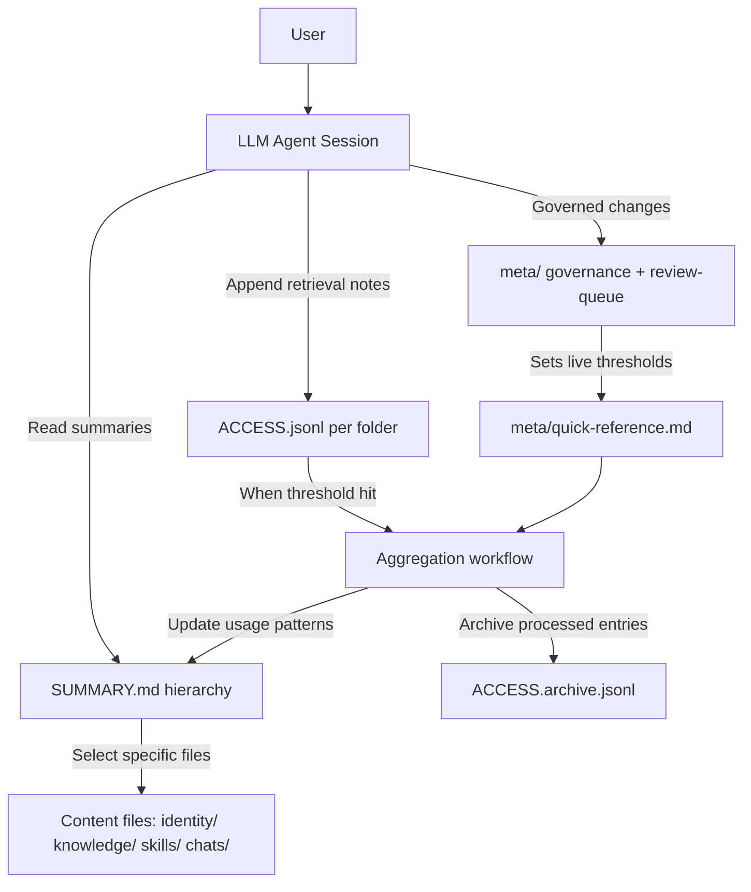
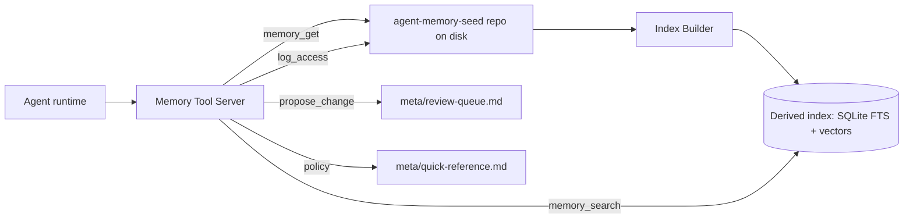

# Deep Research Report: agent-memory-seed Compared with Established LLM Agent Memory Systems

## Executive summary

The `agent-memory-seed` repository is best understood as a **portable, local-first memory substrate** (a git repo of Markdown + governance rules) rather than a “memory service” or “vector database–backed memory engine.” Its design emphasizes: (a) **human-readable, version-controlled memory-as-files**, (b) **explicit governance and change-control tiers**, and (c) **security-oriented instruction containment** (only certain folders may contain executable procedures) with **provenance + trust metadata** and **a quarantine zone** for externally sourced content. citeturn8view0turn11view5turn20view1turn26view2

Relative to established agent-memory systems, `agent-memory-seed` is **strong on transparency, auditability, and memory-injection resilience**, but **weak on algorithmic retrieval automation** (semantic indexing, hybrid retrieval, reranking, latency guarantees) and **lacks a runtime API** that developers can call from applications. Retrieval is primarily “summary-driven navigation” plus a feedback loop via `ACCESS.jsonl`, rather than embeddings + kNN/MMR pipelines. citeturn8view1turn19view0turn26view3

OpenClaw is the closest conceptual comparator because it also treats **Markdown files as memory source-of-truth**, but it layers a mature **memory plugin + tool/CLI** surface on top, including **vector search**, **optional BM25+vector hybrid retrieval**, **MMR re-ranking**, **temporal decay (recency boost)**, and **SQLite vector acceleration** via `sqlite-vec`, with multiple embedding-provider options. citeturn29view0turn30view0turn30view1turn30view2turn32view2

The highest-leverage improvements for `agent-memory-seed` are therefore not “replace the file-based approach,” but **add an optional memory engine sidecar** (CLI + tool server such as MCP) that (1) builds a derived index from the repo, (2) exposes `search/get/propose_change/log_access` tools, and (3) implements a retrieval policy that combines **trust + recency + lexical + semantic** signals (and optionally MMR), while preserving the repo as the canonical durable store. This approach keeps the repo’s core advantage (ownership + auditability) while closing the largest gap vs OpenClaw/LlamaIndex/Mem0/Zep-style systems. citeturn9view2turn19view0turn29view0turn30view1turn38view2turn38view1

## Repository inspection of agent-memory-seed

This section is based on direct inspection of the repository’s `dev` branch file tree, core docs, and scripts/tests. The repository currently shows a relatively small code surface (Shell + Python + HTML), with ~35 commits visible in the GitHub UI at the time of inspection. citeturn28view2turn10view0turn7view0turn10view1

### Architecture and “modules” (directory contracts)

`agent-memory-seed` defines memory as a **five-area repository** whose folder boundaries are explicitly part of the security model:

- `identity/` — durable user traits and preferences (communication style, expertise, values) intended to shape _how_ the agent communicates. citeturn26view4
- `knowledge/` — topic-organized reference and project context; external research must enter via `knowledge/_unverified/` first. citeturn26view1turn26view2
- `skills/` — procedural workflows that the agent may execute; treated as a high-value injection target and therefore “protected-tier.” citeturn18view0turn20view5
- `chats/` — episodic memory with hierarchical summaries (daily/monthly/yearly) and optional transcripts. citeturn26view3
- `meta/` — governance documents, thresholds, review queue, maturity model, and integrity guidance. citeturn19view0turn20view4turn25view1

The repository’s _primary retrieval mechanism_ is an explicit **summary hierarchy** (`SUMMARY.md` at each level), using progressive compression so agents retrieve abstracts first and drill down only when needed. citeturn8view1turn26view3turn26view1turn18view0

### Data models and storage/backends

`agent-memory-seed` uses **files as the storage backend** (git repo on local disk), with two key structured data models:

**Content files (Markdown) with provenance frontmatter.** Files in `identity/`, `knowledge/`, and `skills/` are expected to carry YAML frontmatter with at least: `source`, `origin_session`, `created`, `last_verified`, `trust`. The governance docs define the schema and meaning, and the validator enforces it (with warnings for missing frontmatter). citeturn11view5turn7view0turn20view0

**Access logs (JSONL).** Each retrievable folder contains `ACCESS.jsonl`. Each time the agent retrieves a content file, it appends a JSON object `{file,date,task,helpfulness,note}` with optional `session_id` and later optional `category` (introduced only after the system matures). This log is the primary feedback signal for retrieval quality and curation. citeturn9view1turn7view0turn19view0

There is deliberately **no database dependency** in the baseline template; even the validator is optional and uses only the Python standard library. citeturn9view3turn7view0

### Memory lifecycle, consolidation, and forgetting

Unlike many embedding-first memory systems, `agent-memory-seed` implements consolidation/forgetting via **explicit operational rules**:

- **Trust-weighted retrieval**: trust level influences how a file can be used (e.g., low trust informs but should not instruct; provenance must be surfaced). citeturn20view0turn25view3
- **Temporal decay** keyed off `last_verified` and active thresholds in `meta/quick-reference.md` (e.g., low-trust files past threshold get archived; medium-trust stale files get flagged). citeturn11view4turn19view0turn26view2
- **ACCESS aggregation**: when log entries reach an active threshold, the system prescribes a workflow that updates summaries, identifies high/low-value files, archives processed entries, and detects co-retrieval clusters across folders. citeturn9view1turn19view0turn20view2turn20view3
- **Maturity stages**: Exploration → Calibration → Consolidation, driven by quantitative signals (sessions, access density, coverage, confirmation ratio, retrieval success). citeturn11view8turn19view0

Conceptually, this resembles a “manual-but-defined” version of memory consolidation pipelines in systems like LlamaIndex’s long-term “memory blocks” (fact extraction/vector blocks) or Mem0’s extraction + conflict resolution pipeline, but the automation is intentionally pushed to the agent’s protocol rather than a runtime service. citeturn37view4turn38view2

### Security model and governance controls

Security is one of the repo’s strongest differentiators:

- **Instruction containment and folder contracts**: only `skills/` and `meta/` may contain executable procedures; other folders have “hard boundaries” to reduce memory injection risk. citeturn20view1turn26view1turn26view4
- **Quarantine zone** `knowledge/_unverified/` for all external content until human-reviewed, explicitly framed as an injection defense. citeturn26view2turn19view0
- **Change tiers**: “automatic,” “proposed,” and “protected” changes with explicit approval requirements (notably `skills/` and most `meta/` files). citeturn20view4turn18view0turn8view1
- **Review queue** and **belief-diff log** to surface drift over time and track security flags. citeturn25view2turn25view4
- **Integrity checklist** includes optional commit-signature auditing for protected paths. citeturn25view1turn28view2

### APIs, interfaces, and integration points

There is no programmatic API in the seed repo; the primary “interface” is **agent instruction** in Markdown. Platform adapters are intentionally thin pointers back to `README.md` and `meta/` (e.g., `CLAUDE.md`, `.cursorrules`, `AGENTS.md`). citeturn27view0turn27view1turn27view2turn8view0

Setup and onboarding interfaces:

- **CLI setup** via `setup.sh` (interactive or `--non-interactive` with flags). It can generate platform-specific `chatgpt-instructions.txt` or `system-prompt.txt`, install starter identity templates, initialize git, and optionally make an initial commit. citeturn10view0
- **Browser setup** via `setup.html` (client-side wizard, produces files for download). citeturn11view10turn8view4
- **Read-only onboarding import** via `scripts/onboard-export.sh` to convert a structured “onboarding export” into repo files and commit them. citeturn9view3turn21view2turn22view3

### Dependencies, tests, and what appears missing

Dependencies are minimal and OS-level:

- Shell (bash) + git for `setup.sh` and onboarding import. citeturn10view0turn21view2
- Python 3 for `scripts/validate_memory_repo.py` (standard library only). citeturn9view3turn7view0

Tests exist but are small in scope: a single `unittest` module validates the validator behavior and asserts the seed repo passes validation. citeturn12view0turn13view0

Potentially missing / underdeveloped items (based on the visible file tree and scripts):

- **No visible CI** workflow (e.g., GitHub Actions) to run validator/tests automatically. citeturn28view2turn25view4
- **No visible license file** in the root listing at the time of inspection. citeturn28view0turn28view2
- The curation system specifies aggregation and clustering algorithms, but the repo currently does not ship a corresponding aggregation script (only the validator and onboarding import are implemented as executable scripts). citeturn19view0turn20view3turn7view0

A concrete internal inconsistency worth addressing: starter identity templates use `source: template` and onboarding depends on detecting `source: template`, but the validator’s allowed `source` set does not include `template`, which can make “template-installed” repos fail optional validation until the profile is rewritten. citeturn18view1turn16view1turn7view0

## Survey of established agent memory systems

This survey prioritizes official documentation and original research papers. Systems named by the user (OpenClaw, LangChain, LlamaIndex, ReAct) are covered; additional established/commercial systems include entity["company","Zep","agent memory service"], entity["company","Mem0","agent memory platform"], and entity["company","GitHub","software hosting company"]’s Copilot memory.

### OpenClaw memory (closest structural analogue)

OpenClaw memory is also **Markdown-first**, with workspace files as source of truth (daily append-only logs under `memory/YYYY-MM-DD.md` plus an optional curated `MEMORY.md`). It exposes agent tools `memory_search` and `memory_get` through the active memory plugin (default `memory-core`). citeturn29view0turn29view2turn32view2

What differentiates OpenClaw vs `agent-memory-seed` is not the storage format (both are file-first), but the **built-in indexing + retrieval machinery**:

- **Vector memory search**: watches memory files, builds an embedding index, and supports multiple embedding providers (local and remote), with provider auto-selection rules. citeturn30view3
- **Hybrid search (BM25 + vector)** when full-text search is available, falling back to vector-only otherwise. citeturn30view0
- **Post-processing pipeline** includes optional temporal decay and MMR reranking, with an explicit “Vector + Keyword → Weighted Merge → Temporal Decay → Sort → MMR → Top‑K” pipeline described in docs. citeturn30view1
- **SQLite acceleration (`sqlite-vec`)** for vector queries inside SQLite, with a JS fallback if unavailable. citeturn30view2
- Optional **QMD backend** for memory indexing/search management, with fallback to builtin tools if QMD is unavailable. citeturn30view5

Plugin and ops ergonomics are also stronger: OpenClaw’s `memory-core` plugin is a small TypeScript module that registers `memory_search`/`memory_get` plus a `openclaw memory` CLI command. citeturn32view2turn29view1 The plugins docs also include explicit trust notes about allowlists and plugin shadowing, which becomes a security consideration the moment memory execution depends on third-party plugins. citeturn32view0

### LangChain / LangGraph memory model

LangChain’s current conceptual framing distinguishes **short-term (thread-scoped)** memory vs **long-term (cross-thread)** memory. In LangGraph, short-term memory is maintained as part of agent state and persisted via a “checkpointer,” enabling resume of a thread; long-term memory uses “stores” with customizable namespaces. citeturn35view0

LangChain also explicitly maps agent memory to human memory types (semantic/episodic/procedural), similar to how `agent-memory-seed` separates knowledge/chats/skills. citeturn35view0turn26view3turn18view0

On the implementation side, LangChain supports vector-store–backed conversational memory. For example, `ConversationVectorStoreTokenBufferMemory` combines a token-limited “recent buffer” with retrieval from a vector store, formatting retrieved snippets into history (and timestamping interactions). The reference docs show an example using a vector store retriever (Chroma) with score-thresholded similarity search. citeturn35view3

### LlamaIndex memory (Memory class + memory blocks)

LlamaIndex describes agent memory as a core component that supports `memory.put()` and `memory.get()`; it offers both a flexible `Memory` class and legacy memory types like `ChatMemoryBuffer`, `ChatSummaryMemoryBuffer`, `VectorMemory`, and `SimpleComposableMemory`. citeturn37view6turn37view0

The `Memory` class is particularly relevant to `agent-memory-seed` improvement ideas because it formalizes a **short-term vs long-term split** with a token budget:

- short-term chat history capped by `token_limit` and a `chat_history_token_ratio`; when exceeded, messages are flushed into long-term memory. citeturn37view4
- long-term memory is represented as **Memory Block objects**, including `StaticMemoryBlock`, `FactExtractionMemoryBlock`, and `VectorMemoryBlock`. The docs also describe summarization/reduction when extracted facts exceed configured maxima, and priority-based truncation under token pressure. citeturn37view4
- remote persistence: the docs state the default is an in-memory SQLite database and that a remote database can be used by changing the database URI. citeturn37view6

This design is conceptually adjacent to `agent-memory-seed`’s stage model and trust/provenance rules, but LlamaIndex places more of the consolidation behavior into code (memory blocks) rather than “agent-as-protocol executor.” citeturn19view0turn20view3turn37view4

### ReAct-style memory in research

The original ReAct work focuses on interleaving reasoning traces with actions that query external sources (e.g., knowledge bases), improving interpretability and reducing hallucination/error propagation in certain tasks. It is not a memory system per se, but it is an important “agent loop” foundation that often pairs with a memory store (vector DB, logs, or structured memory) in practical systems. citeturn33search3turn33search12

A more directly memory-centric research reference is “Generative Agents,” which introduces an architecture with a memory stream and retrieval influenced by factors including recency/importance/relevance—conceptually similar to the multi-signal ranking later operationalized in OpenClaw’s temporal decay + MMR pipeline and in graph-based systems like Zep/Graphiti. citeturn33search4turn30view1turn38view1

### MemGPT and Letta’s self-editing memory framing

The MemGPT paper proposes “virtual context management,” inspired by OS memory hierarchies, to support long-running document analysis and multi-session chat by paging information across memory tiers. citeturn34search0

Letta’s current messaging positions “memory blocks” as an abstraction for agent context management rooted in MemGPT’s self-editing memory ideas, with in-context memory blocks that the agent can update. citeturn33search7turn34search0

### Zep / Graphiti: temporal knowledge graph memory

The Zep paper explicitly argues that static-corpus RAG is insufficient for agent memory built from continually evolving user and business data; it introduces Graphiti, a temporally aware knowledge graph engine that maintains a timeline of facts/relationships and organizes memory into episode, semantic entity, and community subgraphs. citeturn38view1

The paper’s evaluation narrative is also useful for `agent-memory-seed` benchmarking: it reports results on the Deep Memory Retrieval (DMR) benchmark and use of LongMemEval, and emphasizes accuracy, latency, and scalability in production retrieval. citeturn38view1

### Mem0: extraction + conflict resolution pipeline

Mem0’s “Add Memory” documentation describes an ingestion pipeline that extracts facts/preferences/decisions from message lists using an LLM, then performs conflict resolution so the “latest truth wins,” with scoping keys like `user_id` and `session_id` and optional metadata to improve later retrieval. citeturn38view2

Third-party integration materials describe Mem0 at a high level as a cycle of extraction, consolidation, and retrieval designed to keep token usage/latency down by surfacing only relevant memories. citeturn34search9

### GitHub Copilot cross-agent memory (commercial, workflow-native)

GitHub’s January 15, 2026 blog post describes a “cross-agent memory system” for Copilot that allows agents to learn across the development workflow (coding agent, CLI, and code review initially), with opt-in controls and a key emphasis on **forgetting/validity** as code changes over branches and time. citeturn38view0

Although the blog is not a full technical spec, it identifies a practical constraint many memory systems under-address: ensuring stored observations remain valid as repositories evolve (branch divergence, abandoned work, conflicting observations), which is closely related to `agent-memory-seed`’s concepts of `last_verified`, trust decay, and periodic reviews. citeturn38view0turn19view0turn11view4

## Feature comparison and gap analysis

### High-level positioning

`agent-memory-seed` and OpenClaw share a foundational belief: **memory is best represented as editable Markdown files the user owns**, not opaque hidden state. citeturn8view2turn29view0

Where they diverge most:

- OpenClaw provides an operationalized **memory toolchain** (indexing, hybrid retrieval, reranking, acceleration, CLI) that scales retrieval quality with corpus size. citeturn30view0turn30view1turn30view2turn29view1
- `agent-memory-seed` provides an operationalized **governance and security framework** (trust/provenance metadata, quarantine, instruction containment, change-control tiers, belief-diff), but leaves indexing/retrieval automation mostly procedural rather than executable software. citeturn20view1turn26view2turn25view4turn19view0

### Detailed comparison matrix

The table below maps `agent-memory-seed` vs each surveyed system along the dimensions you requested.

| Dimension                              | agent-memory-seed                                                                                                                                                               | OpenClaw                                                                                                                                                                 | LangChain / LangGraph                                                                                                                                        | LlamaIndex                                                                                                                                                   | MemGPT / Letta framing                                                                                                                                        | Zep / Graphiti                                                                                                                              | Mem0                                                                                                                                                                                                                       | GitHub Copilot memory                                                                                                            |
| -------------------------------------- | ------------------------------------------------------------------------------------------------------------------------------------------------------------------------------- | ------------------------------------------------------------------------------------------------------------------------------------------------------------------------ | ------------------------------------------------------------------------------------------------------------------------------------------------------------ | ------------------------------------------------------------------------------------------------------------------------------------------------------------ | ------------------------------------------------------------------------------------------------------------------------------------------------------------- | ------------------------------------------------------------------------------------------------------------------------------------------- | -------------------------------------------------------------------------------------------------------------------------------------------------------------------------------------------------------------------------- | -------------------------------------------------------------------------------------------------------------------------------- |
| Canonical storage                      | Git repo of Markdown + JSONL logs; file tree is canonical. citeturn8view0turn9view1                                                                                         | Workspace Markdown files (`memory/*.md`, optional `MEMORY.md`) are canonical. citeturn29view0                                                                         | Agent state persisted via checkpointer; long-term “stores” abstraction. citeturn35view0                                                                   | Default in-memory SQLite + configurable DB URI; long-term memory blocks may use vector DB. citeturn37view6turn37view4                                    | Hierarchical memory tiers; “virtual context management” in MemGPT paper; Letta promotes memory blocks as core abstraction. citeturn34search0turn33search7 | Temporally-aware knowledge graph with episode/entity/community tiers. citeturn38view1                                                    | Memory platform: stores extracted memories + metadata; managed API and OSS flow. citeturn38view2                                                                                                                        | Proprietary memory integrated into dev workflow; cross-agent memory across tools. citeturn38view0                             |
| Memory type coverage                   | Explicitly separated: identity (profile), knowledge (semantic), chats (episodic), skills (procedural), meta (governance). citeturn8view0turn26view3turn18view0turn19view0 | Daily “working/episodic” notes + curated long-term file; plus search. citeturn29view0                                                                                 | Explicit semantic/episodic/procedural framing plus short-term vs long-term. citeturn35view0                                                               | Chat buffer, summary buffer, vector memory; long-term memory blocks include static/facts/vector blocks. citeturn37view0turn37view4                       | OS-inspired tiers for long context; self-editing memory blocks. citeturn34search0turn33search7                                                            | Episodic nodes + semantic entities + community summaries. citeturn38view1                                                                | Focus on user prefs/decisions/facts; supports session scoping and metadata. citeturn38view2turn34search9                                                                                                               | Focus on codebase/conventions/workflow experiences; validity/forgetting emphasized. citeturn38view0                           |
| Retrieval mechanism                    | Summary-driven navigation + agent judgment; no built-in semantic search. citeturn8view1turn26view3                                                                          | Tooled retrieval: `memory_search` (semantic) + `memory_get` (targeted). citeturn29view0turn32view2                                                                   | Depends on implementation; supports vector retrievers and state-based context injection. citeturn35view0turn35view3                                      | Memory `get()` merges short + long-term content; long-term blocks may retrieve from vector DB. citeturn37view4turn37view6                                | Retrieval from slower tiers into context, managed by controller/agent. citeturn34search0                                                                   | Graph queries across temporal KG; designed for evolving facts and relationships. citeturn38view1                                         | Search returns relevant stored memories filtered by scope/metadata; ingestion emphasizes conflict resolution. citeturn38view2turn34search9                                                                             | Cross-agent transfer of learned conventions/observations; details not fully public in blog. citeturn38view0                   |
| Indexing & embeddings                  | None by default; ACCESS co-retrieval clustering is the main “index-like” mechanism. citeturn19view0turn20view2turn20view3                                                  | Vector index over Markdown; optional hybrid BM25 + vector; multiple embedding providers; `sqlite-vec` acceleration. citeturn30view3turn30view0turn30view2           | Vector-store retrievers; e.g., ConversationVectorStoreTokenBufferMemory expects a VectorStoreRetriever and embeds messages for retrieval. citeturn35view3 | VectorMemory / VectorMemoryBlock store/retrieve via vector DB + embed model; long-term memory blocks support fact extraction. citeturn37view0turn37view4 | MemGPT describes tiered paging; Letta promotes memory blocks; embedding specifics depend on deployment. citeturn34search0turn33search7                    | KG-driven; paper motivates beyond classic IR, maintaining timelines of facts/validity. citeturn38view1                                   | Pipeline explicitly extracts structured memories and resolves conflicts; retrieval likely uses indexing under the hood, but “Add Memory” doc emphasizes extraction + conflict resolution. citeturn38view2turn34search9 | Not specified publicly in blog; focus is on UX + validity/forgetting in evolving repos. citeturn38view0                       |
| Retrieval algorithms (kNN/MMR/recency) | Co-retrieval clusters based on session co-occurrence; trust and staleness thresholds; no kNN/MMR described. citeturn19view0turn20view3                                      | Hybrid BM25+vector; optional temporal decay; MMR re-ranking; clear post-processing pipeline. citeturn30view0turn30view1                                              | Varies; vector retrieval supported; message pruning/forgetting discussed. citeturn35view0turn35view3                                                     | Long-term block retrieval can be vector-based; short/long-term merge with token budgeting; truncation by priority. citeturn37view4turn37view6            | Controller policies choose what to page in/out; paper is OS-analogy oriented. citeturn34search0                                                            | Temporal KG maintains validities; designed for dynamic data and production retrieval constraints. citeturn38view1                        | Described as extraction→consolidation→retrieval; conflict resolution “latest truth wins.” citeturn38view2turn34search9                                                                                                 | “What to remember and when to forget” is highlighted; branch validity issues are central. citeturn38view0                     |
| Summarization & consolidation          | Strong: mandatory summaries + reflection protocol; aggregation updates usage patterns; belief diff for drift. citeturn8view1turn19view0turn25view4                         | Has “pre-compaction memory flush” to encourage writing durable memory before context compaction. citeturn29view0turn29view2                                          | Summarization/compaction patterns vary; docs stress controlling long histories because of cost/quality issues. citeturn35view0                            | Chat summary buffers and fact extraction blocks; automatic summarization/reduction when extracted facts exceed limits. citeturn37view0turn37view4        | Self-editing memory implies consolidation happens via agent editing memory blocks. citeturn33search7turn34search0                                         | Community subgraph includes high-level summarizations of clusters. citeturn38view1                                                       | Consolidation described in ecosystem materials; ingestion pipeline includes dedupe/conflict resolution. citeturn34search9turn38view2                                                                                   | Blog frames memory as cumulative knowledge base; forgetting/validity is central. citeturn38view0                              |
| TTL / forgetting                       | Explicit decay rules tied to `last_verified` + stage thresholds; auto-archive low trust after threshold; staleness triggers. citeturn11view4turn19view0turn26view2         | Recency boost is optional; separate session pruning exists (in docs nav), but TTL policies are not the main focus of memory concept page. citeturn30view1turn29view0 | Docs discuss forgetting stale/off-topic content due to context window limits and performance. citeturn35view0                                             | Token-budget truncation and flush policies; long-term retention depends on backend and block design. citeturn37view4turn37view6                          | Tier paging + self-editing implies managed forgetting/compaction by controller. citeturn34search0turn33search7                                            | Temporal validity windows are explicit in KG; “periods of validity” maintain history rather than destructive forgetting. citeturn38view1 | Conflict resolution + consolidation; docs emphasize the latest truth wins; retention policies depend on deployment. citeturn38view2turn34search9                                                                       | Explicitly frames the challenge of remembering and forgetting as code evolves. citeturn38view0                                |
| Privacy & security posture             | Strong explicit guards: quarantine, folder contracts, protected changes, integrity checklists, drift logs. citeturn20view1turn26view2turn25view1turn25view4               | Plugin security/trust warnings in docs; memory is still file-based but plugins add attack surface. citeturn32view0turn29view0                                        | Depends on chosen providers/backends; not a single opinionated security model in the conceptual overview. citeturn35view0                                 | Depends on chosen stores and deployed data sources; memory blocks are code-level constructs. citeturn37view4turn37view6                                  | Self-editing introduces risk of memory corruption without guard rails; paper motivates mechanisms, not full operational governance. citeturn34search0      | Production system focus includes governed retrieval/assembly; details depend on deployment. citeturn38view1                              | Docs emphasize extraction + conflict resolution; privacy/security depends on managed vs OSS deployment. citeturn38view2turn34search9                                                                                   | Opt-in and setting-controlled; exact storage/security mechanisms not detailed in blog. citeturn38view0                        |
| Scalability/latency/cost               | Low infra cost; scaling costs shift to human/agent effort and to “finding the right file” without indexing. citeturn8view1turn19view0                                       | Designed for fast local search with acceleration and configurable providers; supports CLI indexing ops. citeturn29view1turn30view2turn30view3                       | Scales via databases/checkpointers/vector stores, but depends on architecture choices. citeturn35view0                                                    | Token-budgeted memory assembly; remote DB configurable; vector DB costs depend on provider/store. citeturn37view4turn37view6                             | Designed to work around context limits; operational cost depends on memory tier + retrieval frequency. citeturn34search0                                   | Paper explicitly prioritizes scalability/latency in production retrieval. citeturn38view1                                                | Designed to keep token usage/latency low by retrieving only relevant memories; managed service may add cost. citeturn34search9turn38view2                                                                              | Intended to improve effectiveness over time across workflow; cost model bound to Copilot plans. citeturn38view0               |
| Developer ergonomics                   | Great for personal/local workflows; not a callable library/service yet; behavior depends on LLM following instructions. citeturn8view0turn9view3                            | Strong tool/CLI/plugin ergonomics; memory is operationally manageable and integrates into runtime. citeturn29view1turn32view2turn32view0                            | SDK-first; integrates memory into agent state machines and retrievers. citeturn35view0turn35view3                                                        | SDK-first; memory is a component with explicit `put/get` APIs and configurable backends. citeturn37view6turn37view4                                      | Platform + SDK framing; aims to make stateful agents production-ready. citeturn33search7turn38view3                                                       | Production service + open components; graph-based approach is powerful but more complex. citeturn38view1turn34search4                   | Managed vs OSS flows; same payload pipeline; explicit scoping and metadata improves ergonomics. citeturn38view2                                                                                                         | Integrated into GitHub product workflows; developer control via settings, but limited customizability vs OSS. citeturn38view0 |

### Core gaps for agent-memory-seed relative to the field

1. **No semantic retrieval layer** comparable to OpenClaw’s `memory_search` (vector/hybrid/MMR/recency), LlamaIndex `VectorMemoryBlock`, or LangChain vector-backed conversation memory. citeturn30view3turn37view4turn35view3
2. **No programmatic API** for apps/agents to read/search/write with governance enforcement; integration is currently prompt-instructions + manual file access on some platforms. citeturn9view3turn27view0turn11view5
3. **Automation gap**: many behaviors are specified (aggregation, cluster detection, maturation transitions) but not shipped as executable tooling. citeturn19view0turn20view3turn7view0
4. **Limited evaluation harness**: the repo defines maturity signals and helpfulness scoring, but does not provide a benchmark suite or retrieval-quality metrics comparable to DMR/LongMemEval-style evaluations used in Zep’s paper. citeturn11view8turn19view0turn38view1

## Prioritized recommendations for improving agent-memory-seed

The recommendations below are designed to preserve the project’s defining advantages—**file ownership, transparency, governance, and auditability**—while closing the main gaps around **retrieval automation, developer ergonomics, and evaluation**. citeturn8view2turn20view4turn30view1

### Recommendation roadmap with effort, risks, and trade-offs

| Priority | Recommendation                                                                                                                                                                                                                                                                                                              | What it unlocks                                                                                                                                                           | Effort / complexity | Key risks / trade-offs                                                                                                                                                                                       |
| -------- | --------------------------------------------------------------------------------------------------------------------------------------------------------------------------------------------------------------------------------------------------------------------------------------------------------------------------- | ------------------------------------------------------------------------------------------------------------------------------------------------------------------------- | ------------------- | ------------------------------------------------------------------------------------------------------------------------------------------------------------------------------------------------------------ |
| P0       | **Fix schema inconsistency around `source: template`** (either add `template` to allowed `source` values in docs + validator, or have setup rewrite templates to an allowed source while keeping a separate `template_origin` marker). citeturn7view0turn16view1turn18view1                                            | Prevents optional validation failures after “starter profile” setup; reduces confusion; aligns onboarding detection with validation. citeturn9view3turn18view1        | Small               | If you allow `template` broadly, you must decide how it affects trust decay and provenance pause semantics. citeturn20view1turn11view4                                                                   |
| P0       | **Add CI (GitHub Actions) to run validator + tests** on PRs and pushes; optionally add a pre-commit hook. citeturn7view0turn13view0turn25view4                                                                                                                                                                         | Prevents regressions in governance/runtime guidance; increases trust for adopters; supports “memory as infrastructure.”                                                   | Small–Medium        | CI must be carefully scoped to avoid leaking private memory if users fork personalized repos; ensure workflows are template-safe. citeturn8view2turn26view4                                              |
| P1       | **Ship an “index + search” sidecar** (local CLI/service) that builds a derived index from the repo and exposes `memory_search` / `memory_get` equivalents, while keeping files as source-of-truth. Model it after OpenClaw’s file-backed search tools. citeturn29view0turn32view2turn8view2                            | Semantic recall at scale; faster retrieval; reduced reliance on perfect summaries; creates a real API surface for apps/agents. citeturn30view3turn35view3turn37view4 | Medium–Large        | Adds dependencies (embeddings + index store); introduces privacy/cost considerations if remote embeddings used; must enforce trust and folder constraints in the tool itself. citeturn20view1turn30view3 |
| P1       | **Implement ACCESS aggregation as an actual script** (e.g., `scripts/aggregate_access.py`) that parses `ACCESS.jsonl`, updates `SUMMARY.md` usage patterns, archives entries, and emits cluster suggestions, respecting maturity stage thresholds from `meta/quick-reference.md`. citeturn19view0turn9view1turn20view2 | Turns a protocol into executable maintenance; improves summary quality over time; enables dashboards/metrics. citeturn20view0turn11view8                              | Medium              | Automation risks changing meaning in summaries; must assume “proposed/protected” tiers and write to `meta/review-queue.md` instead of silently editing protected files. citeturn20view4turn25view2       |
| P2       | **Adopt a multi-signal retrieval policy**: trust-weighted + recency boost + lexical (BM25/FTS) + vector similarity + optional MMR reranking. OpenClaw’s documented pipeline is a strong reference. citeturn30view0turn30view1turn20view0turn19view0                                                                   | Higher precision and diversity; better “needle” retrieval for IDs/symbols via lexical; fewer redundant results via MMR. citeturn30view0turn30view1                    | Medium              | Combining signals can create surprising behavior; needs evaluation harness and tuning; may be overkill for very small repos.                                                                                 |
| P2       | **Introduce a lightweight “memory blocks” layer** (optional) for structured long-term memory (facts/preferences/constraints) inspired by LlamaIndex memory blocks and Mem0 extraction+conflict resolution. citeturn37view4turn38view2                                                                                   | Automated extraction of durable facts, conflict handling, and stable “profile” memory that is easy to inject into prompts. citeturn35view0turn38view2                 | Medium–Large        | Extraction can hallucinate; must route outputs into quarantine or `trust: low/medium` until verified; increases complexity vs pure Markdown. citeturn26view2turn11view4                                  |
| P2       | **Add evaluation + benchmarks**: (a) repo-native retrieval metrics (precision@k, MRR), (b) long-memory benchmarks such as DMR/LongMemEval where feasible, and (c) security regression tests for injection patterns. Zep’s paper provides useful benchmark references. citeturn38view1turn11view8turn25view1            | Makes improvements measurable; supports maturity-stage tuning; prevents regressions in retrieval quality and security posture. citeturn11view8turn19view0             | Medium              | Benchmarks may not match personal-memory use cases; need careful synthetic datasets that don’t leak real user data.                                                                                          |
| P3       | **Provide an MCP server interface** (explicitly floated as a future direction in DESIGN) with operations: read/search/propose_change/log_access/get_context. citeturn9view2turn11view5turn19view0                                                                                                                      | Standard tool interface usable by IDEs and agent runtimes; reduces platform-specific adapters; enables multi-agent use. citeturn9view2turn27view0                     | Large               | Tool server must be hardened (authz, path sandboxing); needs a permissions model aligned with `meta/update-guidelines.md`. citeturn20view4turn25view1                                                    |
| P3       | **Repository hygiene additions**: add LICENSE, CONTRIBUTING, SECURITY policy, and clear “template → personal repo” guidance to prevent users from accidentally running CI on private memory. citeturn28view0turn25view1                                                                                                 | Reduces adoption risk; improves OSS clarity; supports enterprise use.                                                                                                     | Small–Medium        | Needs careful messaging: the template is intended to become personal data; governance must reflect that. citeturn8view2turn26view4                                                                       |

### Implementation sketches (pseudo-code)

The following pseudo-code and patterns are designed to be _drop-in additions_ that do not break existing repos.

**A derived indexer that respects trust and folder contracts**

Key design: index only what is allowed, and carry metadata needed for trust-weighted retrieval (path, folder, trust, source, created/verified dates). Ingestion of `knowledge/_unverified/` should either be excluded from default search or heavily downweighted and flagged in results. citeturn20view1turn26view2turn19view0turn30view1

```python
# PSEUDO-CODE (Python)
# Build a derived index from Markdown memory repo.

for md_file in iter_markdown_files(root, include=["identity","knowledge","skills","chats"], exclude=["meta"]):
    doc = parse_markdown(md_file)
    fm = parse_frontmatter_if_present(doc)
    folder = top_level_folder(md_file)

    # Enforce folder contract at indexing time
    if folder in ("knowledge", "identity") and contains_procedural_patterns(doc):
        emit_security_flag(md_file, reason="instruction containment violation")
        # Option: index as low-trust but exclude from auto-recall injection

    # Determine trust/recency weights from frontmatter + quick-reference thresholds
    trust = fm.get("trust", "medium")
    last_verified = fm.get("last_verified", None)

    chunks = chunk_markdown(doc, by="heading+tokens", max_tokens=350)
    for chunk in chunks:
        embedding = embed(chunk.text)  # provider-configurable
        lexical_terms = extract_terms(chunk.text)

        index.upsert({
            "id": stable_chunk_id(md_file, chunk),
            "path": str(md_file),
            "folder": folder,
            "trust": trust,
            "source": fm.get("source"),
            "created": fm.get("created"),
            "last_verified": last_verified,
            "text": chunk.text,
            "embedding": embedding,
            "lexical": lexical_terms,
        })
```

**A query-time scoring function inspired by OpenClaw’s pipeline, extended with trust weighting**

OpenClaw describes weighted merge + temporal decay + optional MMR re-ranking. `agent-memory-seed` adds explicit trust/provenance gates; incorporate these as either weights or hard filters. citeturn30view1turn20view0turn19view0

```python
# PSEUDO-CODE
def score(result, query_ctx):
    # base semantic + lexical
    s = 0.7 * result.vector_sim + 0.3 * result.bm25_score

    # recency boost (temporal decay as in OpenClaw docs conceptually)
    s *= recency_multiplier(result.last_verified or result.created)

    # trust weighting (repo-specific)
    s *= {"high": 1.0, "medium": 0.85, "low": 0.55}[result.trust]

    # quarantine penalty / disclosure requirement
    if result.path.startswith("knowledge/_unverified/"):
        s *= 0.25

    return s

def search(query):
    candidates = hybrid_retrieve(query, top_n=200)
    scored = sorted(candidates, key=lambda r: score(r, query), reverse=True)
    diverse = mmr_rerank(scored, lambda_=0.7)  # optional
    return diverse[:K]
```

**ACCESS aggregation script outline**

This converts the spec in `meta/quick-reference.md` and `meta/curation-policy.md` into executable maintenance while preserving the change-control tiers (e.g., write proposals to `meta/review-queue.md` rather than silently changing protected-tier files). citeturn19view0turn20view3turn25view2turn20view4

```bash
# PSEUDO-CODE (CLI)
aggregate-access --folder knowledge --dry-run
aggregate-access --all --stage exploration
```

## Architecture and memory lifecycle diagrams

### Current agent-memory-seed architecture and data flow

This diagram reflects the repo’s explicit contracts: summary-driven retrieval, logging via `ACCESS.jsonl`, and periodic review/aggregation governed by `meta/quick-reference.md`. citeturn8view0turn9view1turn19view0turn20view4



### Proposed “sidecar memory engine” architecture (API + index) that preserves file ownership

This is a compatibility-first plan: the repo remains canonical, but a derived index enables OpenClaw-like retrieval ergonomics (search/get) and makes it easier to integrate into agent runtimes via a tool interface (e.g., MCP). citeturn9view2turn29view0turn30view3turn20view4



### Memory lifecycle flowchart (required)

This flowchart aligns the repo’s documented lifecycle stages (capture → provisional storage → verification/promotion → retrieval feedback → decay/archive) with the maturity-stage governance model. citeturn11view3turn11view4turn19view0turn25view4

```mermaid
flowchart TD
  C[Capture in session] --> P[Provisional storage<br/>trust: low/medium]
  P --> Q{External source?}
  Q -->|Yes| UQ[Write to knowledge/_unverified/<br/>trust: low]
  Q -->|No| K[Write to knowledge/ or identity/ with provenance]

  UQ --> V{User verifies?}
  V -->|Approve| PR[Promote to knowledge/<br/>update trust + last_verified]
  V -->|Reject or stale| AR[Auto-archive after threshold]

  K --> R[Retrieval in future sessions]
  PR --> R

  R --> LOG[Append ACCESS.jsonl entry<br/>helpfulness + task]
  LOG --> TH{Aggregation trigger reached?}
  TH -->|Yes| AGG[Aggregate + update SUMMARY.md<br/>find clusters + low-value files]
  TH -->|No| R

  AGG --> DECAY[Apply trust decay rules<br/>(flag/demote/archive)]
  DECAY --> BD[Belief diff log / review queue]
  BD --> R
```
